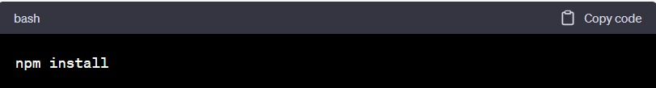

<h2>Projeto utilizando React e TypeScript com a API do GitHub</h2>

Este é um projeto desenvolvido utilizando a biblioteca React e a linguagem TypeScript, com o objetivo de consumir a API do GitHub.
 

<h3>Configuração do ambiente</h3> 

Certifique-se de ter o Node.js instalado em sua máquina. Para instalar as dependências do projeto, execute o seguinte comando no terminal: 

 

<h3>Executando o projeto</h3> 

Para iniciar o projeto localmente, execute o seguinte comando:

