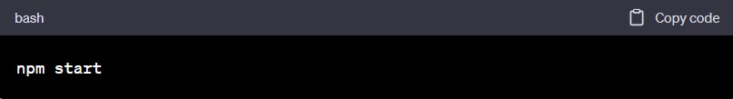

<h2>Projeto utilizando React e TypeScript com a API do GitHub</h2>

Este é um projeto desenvolvido utilizando a biblioteca React e a linguagem TypeScript, com o objetivo de consumir a API do GitHub.
 

<h3>Configuração do ambiente</h3> 

Certifique-se de ter o Node.js instalado em sua máquina. Para instalar as dependências do projeto, execute o seguinte comando no terminal: 

 

<h3>Executando o projeto</h3> 

Para iniciar o projeto localmente, execute o seguinte comando:

 

Após a execução, abra seu navegador e acesse<strong> http://localhost:5173</strong> para visualizar o aplicativo.

<h3>Estrutura do projeto</h3>

A estrutura do projeto é organizada da seguinte maneira:

 - src/: Contém os arquivos fonte do projeto.

 - components/: Diretório com os componentes reutilizáveis.

 - routes/: responsáveis por definir as rotas da aplicação.
